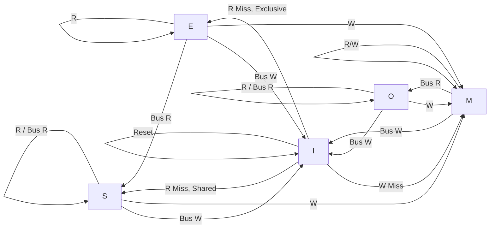

## Parallel Processing

### Loop Unrolling
Loop unrolling decreases the number of branch instructions and comparators which are the bottlenecks of datapath.

###### Rolled
```c
    int x;
    for (x = 0; x < 100; x++)
    {
        delete(x);
    }
```
There is 100 sets of branch instrucitons.

###### Unrolled
```c
    int x; 
    for (x = 0; x < 20; x += 5 )
    {
        delete(x); // For loop here?
        delete(x + 1);
        delete(x + 2);
        delete(x + 3);
        delete(x + 4);
    }
```

There is now only 20 sets of branch instrucitons. 

* One may make a for loop to do the unrolled statements. Many compilers are able to recognize these kinds of for loops.

### SIMD - Intel SSE Intrinsics
Single instrucitons multiple data (**SIMD**) is a **data-level parallelism** design that operates a single instruction onto multiple data. Let's use the Intel SSE Intrinsics as an example.

* Implemented by using larger registers called scalar registers.
* SSE scalar registers are named `xxm0, xxm1,...xxmN` and are `128-bit` each.
* Often used for `int` and `float` thus holding four `32 bit` elements

#### Syntax
|           |          Syntax           |           Example           |
| --------- | ------------------------- | --------------------------- |
| Datatype  | `__m[size][type]` | `__m256epi` <br> `__m256ps` |
| Functions | `_mm_[func]_[type]`        | `_m256i_add()`              |

#### Functions
|                  |              Syntax               |                      Description                      |                       Example                       |
| ---------------- | --------------------------------- | ----------------------------------------------------- | --------------------------------------------------- |
| Load             | `_mm_loadu_[type](address)`       | Load the next vector from `address`                   | `v1 = _mm_loadu_ps(ptr) // ptr points to some data` |
| Arithmetic       | `_mm_[arithmetic]_[type](v1, v2)` | Apply `arithmetic` to two vectors                     | `_mm_add_ps(v1, v2)`                                |
| Initialize / Set | `_mm_set1_[type](arg)`            | Create a vector with all values equal to `arg`        | `_mm_set1_ps(0) // <0, 0, 0, 0>`                    |
| Store            | `_mm_storeu_[type](arr, v)`      | Store the elements of vector `v` to some array `arr` | `_mm_storeu_ps(arr, v1)`                            |


#### Example of SSE Code

```c
    float eval_lagrange_fast(float *X, float *Y, float c, size_t n, size_t k) {
        float retval = 1, m[4];
        size_t i;
        __m128 ret_vec = _mm_set1_ps(1); // single precision (sp) floating point vector vector <1, 1, 1, 1> 
        for (i = 0; i < n/4; i += 1) {
            if (i == k/4)
                continue;
            ret_vec = _mm_mul_ps(ret_vec, _mm_sub_ps(_mm_set1_ps(c),
            _mm_loadu_ps(X + i*4)));
            ret_vec = _mm_div_ps(ret_vec, _mm_sub_ps(_mm_load1_ps(X + k),
            _mm_loadu_ps(X + i*4)));
        }
        for (i = k/4*4; i < k/4*4 + 4; i += 1) {
            if (i == k)
                continue;
            retval *= c - X[i];
            retval /= X[k] - X[i];
        }
        _mm_storeu_ps(m, ret_vec);
        return Y[k] * retval * m[0] * m[1] * m[2] * m[3];
    }
```

### MIMD - OpenMP

Multiple instruction multiple data (**MIMD**) is a thread-level paralellism design. 

* Multithread in a single core allows the illusion of simultaneous multiprocessing. This is done by smart task managing by the operating system.
* Each thread has separate registers and PC but the memory is shared.

Let's use OpenMP as an example.

#### OpenMP Directives

Directives are placed in the code to signify which block of code are to be in distributed and what type of multithread process is to be done with those blocks.

```c
##pragma omp [options]
{
    [body]
}

```

###### Parallel

The `parallel` option is used when specific parts of the memory can be assigned to each thread.

The example below uses 2 threads to compute $2^{100}$. Logically this should be 2x faster than a single thread (not really since its implementation dependent).
```c
    NUM_THREADS = 2
    double prod[0] = 2
    double prod[1] = 2
    double result = 1

    ##pragma parallel {
        id = omp_get_thread_num()
        for (int i = 0; i < 100; i += NUM_THREADS) {
            prod[id] *= 2
        }
    }
    result *= prod[0] * prod[1]
```

###### Critical
The `critical` option creates a critical section for threads required to access shared memory.

```c
    NUM_THREADS = 2
    double prod[0] = 2
    double prod[1] = 2
    double result = 1

    ##pragma omp parallel {
        id = omp_get_thread_num()
        for (int i = 0; i < 50; i += NUM_THREADS) {
            prod[id] *= 2
        }
    ##pragma omp critical
        result *= prod[id]
    }
```

###### Parallel For
The `parallel for` option can be assigned to each thread by consecutive chunks. 

```c
##pragma omp parallel for{
    int a = [1,2,3,4];
    int i;
    for (i = 0; i < len(a); i++) {
        print(a[i])
    }
}
// prints 1 2 3 4 in any order depending on which threads finishes first.

int NUM_THREADS = 0;
int result;
int prod[NUM_THREADS]
##pragma omp parallel for{
    int id = omp_get_thread_num()
    for (int i = 0; i < 100; i++) {
        prod[id] *= 2
    }
}
```

#### Shared Memory

Because memory between are shared we can get a bug called a **race condition**. A race condition is caused due to the threads accessing the same memory (often when writing). 

* If all threads write to a memory then only the latest write is saved.

The solution to this issue is to allow a thread to **lock** the data needed through the process called **atomic memory operatons (AMO)** . 

* The AMO is implemented onto the ISA with specific opcodes
* See [critical section](#critical) for an example of OpenMP using AMO.

A typical AMO does the following:

1. Checks to see if data queried is locked.
    * If locked, wait until it's unlocked.
    * If unlocked, lock it and continue to step 2.
2. Perform the instructions needed (called **critical section**)
3. Unlock the data if finished.

## Cache Coherency

* **Bus** : Connection between each cores.
* **Snoop** : A signal asking the bus if anything changes.

### MOESI Protocol

**Reminder:** Dirty means memory is not up to date.

* **M**odified
    * Only this cache has a copy
    * Dirty
* **O**wned
    * More than one cache has a copy
    * Dirty
    * This cache responsible to write to memory
* **E**xclusive
    * Only this cache has a copy
    * Clean
* **S**hared
    * More than one cache has a copy
    * Either dirty or clean
    * This cache is not responsible for writing to memory
* **I**nvalid
    * Unusable since the block is not updated



## Cache

### Cache Policy

#### Write Through
* All changes are written to the memory8
#### Write Back

