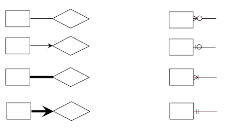

A set of attribute that describes the real world (e.g., employees) with attributes (e.g., employee_id)

* **Entity set:** A collection of similar entities
    * Each entity set has a key
    * Each attribute has a domain (type)
* **Relationship:** An idea of a relationship
    * Think of the relationship when creating views.

## Constraints

* **Key constraint**:
    * **One to Many**: A key constraint on an entity such that each row of the entity can point to many rows of the other entity.
    * **Many to Many**: If there are no key constraint on an entity such that any row of the entity can point to any row of the other entity.
    * **One to one**: If there are key constraint on both entity then each row of each entity can only point to one.
    *  One to many and one to one implies **at most one**

* **Participation constraint**:
    * A participation constraint on an entity such that every row must be part of the relationship to another entity.
    * This implies **at least one**.

## Weak Entities
An entity owned by a primary key of the another (owner) entity that isn't a full entity.

* Must have total participation.
* A weak entity has a partial key which can be a full key once it relates to its owner entity's primary key.

## Entity to Schema
* Key Constraints
    * One to One: `FK(pk_1), FK(pk_2)`
* Participation Constraint
    * Full participation = `NOT NULL`
* Weak entity
    * Composite key on id and the foreign key `PK(pk, fk), FK(fk)`