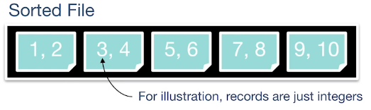
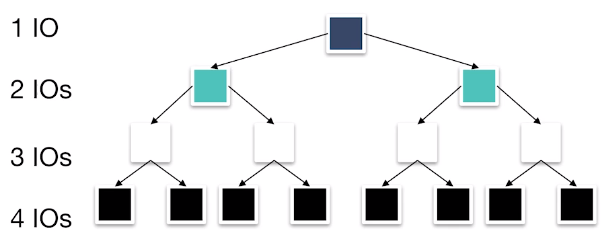

The memory architecture for storing data uses a file hierarchy.

* **Files**: Stores a table
* **Pages**: A collection of records
* **Records**: The row of a table

The file has a structure managing pages and structure:

* Unordered heap files
* Clustered heap files
* Sorted files
* Index files

## Unordered Heap Files

Collection of records in no particular order. Not the same as min heap structure.

* As file size changes, the pages are (de)allocated

### Implementation: Doubly Linked List

A header file is double linked to each page which indicates the data stored and the amount of free space.

* Implementation is slow when determining which page has free space

### Implementation: Page Directory

* A header page consist a pointer to the page and how much free space the page has.
* Header page is likely cached.

## Sorted Files (Ordered Heap Files)

Let's take a look at the performance between a sorted file and heap file:

|                  | Heap File |    Sorted File      |
| ---------------- | :-------: | :-----------------: |
| Scan all Records |    B*D    |        B*D          |
| Equality Search  |   B*D/2   |      (lg B)*D       |
| Range Search     |    B*D    | (lg B + matches)*D  |
| Insert           |    2*D    |    (lg B + B)*D     |
| Delete           |   (B/2+1)*D   |    (lg B + B)*D |

* **B**: Number of data blocks in the file
* **R**: Number of records per block
* **D**: Average time to read/write disk to block
  

### Scan
Reading records from left to right does not matter whether or not the heap is sorted. So, the number of read is the number of pages $B$.

### Equality Search: Search for a single match.

For the heap file, since the order is random in nature we use probability. The probability that the key is on some page is

$$P(i) = \frac{1}{B} $$

The number of pages the search looked at is also $i$. We are interested in the expected value,

$$\Expected{i} = \sum_{i=1}^B i P(i) = \frac{B+1}{2} \approx \frac{B}{2}$$

Now for the sorted file. You can see that it's best to start searching from the center then search halfway either to the left or right. Then repeat this process until found. This is binary search:

$$ \Expected{i} = \sum_{i=1}^{\log_2{B}} i \frac{2^{i-1}}{B} = \log_2 B - \frac{B-1}{B}  \approx \log_2{B}$$

From this binary tree, we see that from the center to the next midpoint cost two IO (i.e., edges traversed) and the sub-midpoints cost an extra IO each.

### Range Search: Search for all matches within a range.

For the heap file, we must search through all pages.

$$ \Expected{i} = B $$

For the sorted file, we only have to go down a path in the binary tree, start collecting when within range and stop when out of range. Let $i$ be the page number and $R$ be the range then the expected reads is,

$$ \Expected{i} \approx \log_2 B + |\set{i: i \in R}| $$

### Insertion

For the heap file, we must read the page then append,

$$\Expected{i} = 2D$$

For the sorted file, first we find where the value goes which cost $\log_2 B$ and then shift the rest of the values to the right. On average the insertion is in the middle, so the rest of the values are half of $B$. However we got to do this twice so shifting cost $B$.

$$\Expected{i} = \log_2 B + B$$

### Deletion

For the heap file, we first search for the page then delete by writing so the pages read is,

$$ \frac{B}{2} + 1$$

For the sorted file, we first do a search then repack the whole heap by shifting left.

$$ \log_2{B} + B $$