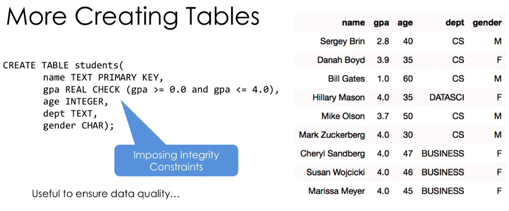
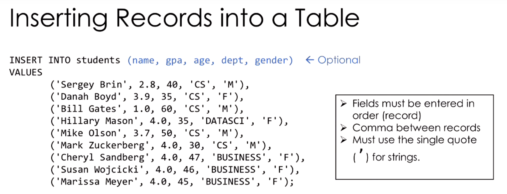

# Lecture Notes 11

## REST - Representational State Transfer

A way of architecting widely accessible, efficient, and extensible web service (typically using HTTP).

Here are the following properties of REST

* **Cilent-Server**: Client and server operate and evolve independently.
* **Stateless**: Server do not store the state of the client thus the any sequential request must be handled by the client.
* **Cacheable**: There exist client-server rules on what things are cacheable.
* **Uniform Interface**: Provide a consistent interface for getting and updating data in a system.

You will be using the REST API for Twitter in project 1.

## Databases

A **database** is an organized collection of data. In this class we will be using a **database management system (DBMS)**.

A DBMS has the following properties:

* Stores data
* Organizes the data and manages data properties (e.g., type)
* Facilitates access

The type of DBMS often used are called **relatoinal DBMS** where the data are not stored as one would think (a table of row and column) but instead in a data structure in some sort of relation (e.g., tree, heap) that are hidden away from the user interface. In the end relational models are a table system.

## Structured Query Language (SQL)
> "What we want to compute not how we want to compute it"

SQL (pronounced  like "sequel" not "S-Q-L") is a **declarative** language (see quote above).

Here are some vocabulary to know:

Relations
: Table

Attribute
: Column

Tuple
: Record or row

Schema
: description of columns, their types, and constraints

Schema of the Database
: a set of schemas of its relations

Instance
: data satisfying the schema

### SQL Types

* **CHAR(size)**: Fixed number of characters
* **TEXT**: Arbitrary number of character strings
* **INTEGER & BIGINT**: Integer of various sizes
* **REAL & DOUBLE PRECISION**: Floating point numbers
* **DATE & DATETIME**: Date and Date+Time formats


### Create Table

---

</img>

---

### Inserting Records

Inserting records is writing data into a table

---



---

### Modifying Records

* **Delete** an entry

    ```sql
    DELETE FROM table_name WHERE column_name = '[value]'
    ```

* Change an entry

    ```sql
    UPDATE students
        SET column_name1 = '[value]'
        WHERE column_name2 = '[value]'
    ```

### Querying Records

The basic structure of a single table query is:

```sql
SELECT [DISTINCT] <column expression list>
    FROM <single table>
    [WHERE <predicate>]
    [GROUPBY <column list>]
    [HAVING <predicate>]
    [ORDER BY <column list>]
    [LIMIT <integer>]
```

Thing in square brackets `[]` are optional and angle brackets `<>` are placeholders.

## Python and SQL

### SQLite
Python has many tools to operator with SQL. Python can create its own database with **pySQLite** (`sqlite`)or **SQLite** for short. SQLite is a very basic DBMS where one may create a local database stored in a `.db` file and execute SQL queries.


### SQLAlchemy
A really powerful DBMS for python is **SQLAlchemy** (`sqlalchemy`) which supports database created by SQLite. What SQLAlchemy provide is all the functionality of SQLite with object oriented method of handling database. This method is called Object Relational Mapper (**ORM**) which treats the relations inside a database as class and objects

> SQLALchemy is so powerful they cannot write a simpler (pythonic) documentation. See [docs](http://docs.sqlalchemy.org/en/latest/).

### Pandas and SQL
Pandas has built to handle SQL including SQLite database. 