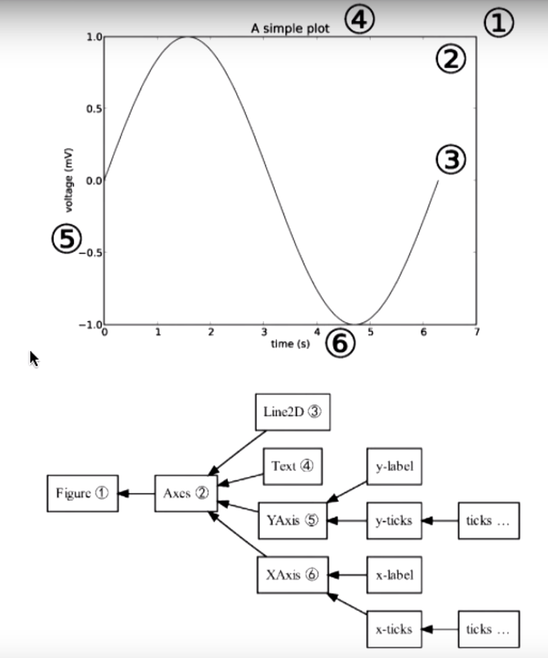

# Lecture Notes 8

## Multiple Plots in Matplotlib
We will be using a different convention in using Matplotlib. Matplotlib was a object-orientated program based on a single class invoked by `plt.plot()` which plots things into a figure object called `matplotlib.pyplot.figure` (see [docs](https://matplotlib.org/api/_as_gen/matplotlib.pyplot.figure.html)). However plotting more than one plot in the same figure or even different figure can be very confusing if you were to use `plt.plot` like you were taught at the beginning.

Instead we will splits the plot into two objects the figure and axes object,

```python
fig2, ax1 = plt.subplots()
ax1.plot(x1, y1) # for some x1 and y1
ax1.plot(x2,y2) # for some other x2 and y2 on the same figure
ax1.legend()
ax1.set_title(`Title`)
ax1.set_ylabel(`Title`)
ax1.set_xlabel(`Title`)


# Second figure (plotted on second figure)
fig2, ax2 = plt.subplots()
```

<center></center>****

## Guidelines of a Good Plot

1. Scale
    * Numerical spacing of data
2. Conditioning
    * Orientation of data 
3. Perception
    * Data type
    * Color
4. Transformation
    * Mathematically transform a data (e.g., log-log plots)
5. Context
    * Labels
    * Reference lines
6. Smoothing
7. Philosophy