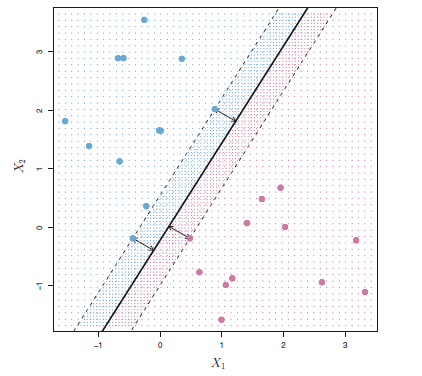

Because there may exist infinitely many hyperplane that can classify the input data, we need to determine which hyperplane is the best fit. Naturally, points that are closer to the hyperplane are considered more ambiguous and error-prone than those further away from the hyperplane. Given this metric, we consider the best hyperplane to be one that is furthest away from its immediate neighboring data points. This method is coined the name **maximal margin classifier (MMC)**

Support Vectors
: The "immediate neighboring data points" that are used to determine the best hyperplane.

Margin $(M)$
: The length of the support vector(s). Alternatively, the distance between the hyperplane and the nearest point(s).

  

Formally, the MMC takes the loss metric as the margin $M$ (actually this is a gain metric) and attempts to maximize $M$ given the following:

$$
\begin{gather*}
     \max_{\theta} M\\
     \lvert{\theta}\rvert^2 = 1\\
     y_i(\theta^TX_i + \theta_0) \ge M
\end{gather*}
$$

* MMC are not always possible as you can think of datasets where the decision boundaries are not linear.
* MMC can be very senesitive to new data points.

## Simplified Maximal Margin Classifier

We simplify the constraint by transforming the marign to unity,

$$ y_i(\theta^T X_i + \theta_0) \ge 1 $$

* This transformation is invariant because all we're doing is rescaling $\theta \rightarrow \frac{\theta}{M}$.

Now the optimizing problem is over the parameter space which is called the **quadratic program**. As the name suggest, we optimize of $\lvert{\theta}\rvert$ to allow differentiation.

$$
\min_{\theta, \alpha} \lvert \theta \rvert^2
$$

### Derivation

The ambiguity of our optimizer coming from a maximizer to a minimizer problem will now be solved here. The distance from the point $X_i$ to the hyperplane in the feature space is given by,

$$
\frac{\theta^T X_i + \theta_0}{\lvert \theta \rvert^2}
$$