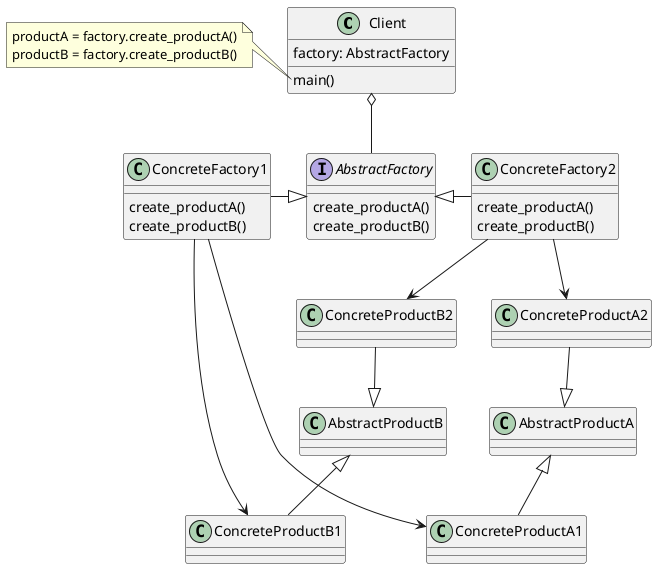

#  Abstract Method

Produce families of related objects without specifying their concrete classes.

```puml
@startuml
Client o-- AbstractFactory
AbstractFactory <|--left ConcreteFactory1
AbstractFactory <|--right ConcreteFactory2
ConcreteFactory1 --> ConcreteProductA1
ConcreteFactory1 --> ConcreteProductB1
ConcreteFactory2 --> ConcreteProductA2
ConcreteFactory2 --> ConcreteProductB2
AbstractProductA <|--down ConcreteProductA1
AbstractProductA <|--up ConcreteProductA2
AbstractProductB <|--down ConcreteProductB1
AbstractProductB <|--up ConcreteProductB2

class Client {
  factory: AbstractFactory
  main()
}
note left of Client::main
productA = factory.create_productA()
productB = factory.create_productB()
end note

interface AbstractFactory {
  create_productA()
  create_productB()
}

class ConcreteFactory1 {
  create_productA()
  create_productB()
}

class ConcreteFactory2 {
  create_productA()
  create_productB()
}
@enduml
```