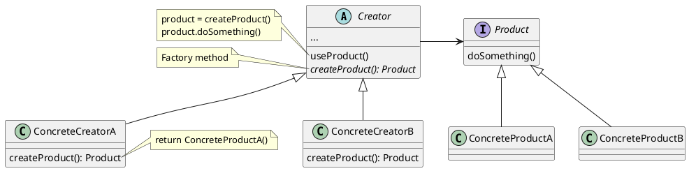

#  Factory Method

Separates object (**product**) creation from usage in the main class (**creator**). The creation of the object is done in the superclass but allows the subclass to alter the type of objects to be created.

# Usage

The separation of creation and usage is the core purpose of the factory method. Therefore, the advantages are:

* New product types are created from implementing the product and subclassing the creator.
* Allow external users to extend both usage and product types *a la* above