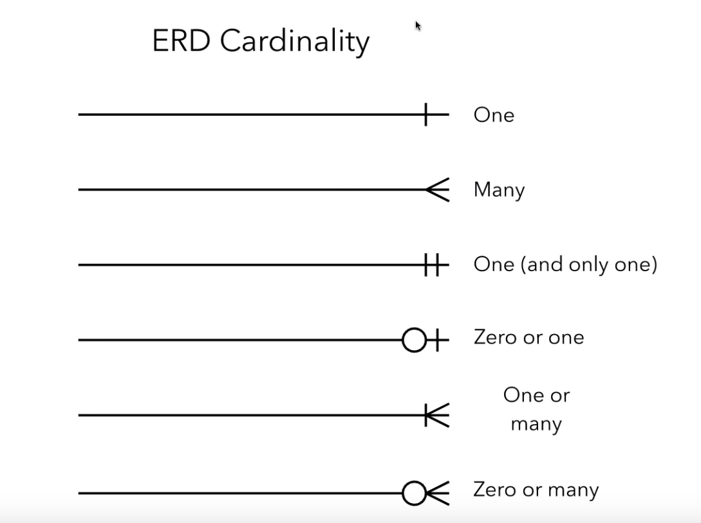

#  Entity Relationship Diagram

In an entity relationship diagram (ERD), we have the following objects:

* Relations (diamond)
    * Attributes
* Entity (circle)
    * Attributes
    * Primary key
* Relationships (line connectors or cardinality)

## Cardinality

One
: Test

Many
: Test

One (and only one)
: Entity is related to only one of the other entity.

    $$ F(x) \neq G(y) \quad x \neq  y $$

Zero or one
: Entity is related to one or none of the other entity.

One or many
: Entity is related to at least one of the other entity.

Zero or many
: Entity is related to a nonnegative number of the other entity.

