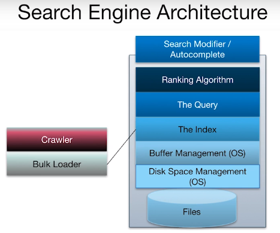

Text search is done with a search engine (aka informational retrieval system).

Document
: A file, website, or generally a collection of unstructured data that can be text searched.

## Architecture

Informational retrieval system (IR) are structured similar to a DBMS however differs in such ways:

* No relational operations
* Ranks top result with no need to finish finding all that satisfy the query
* A crawler used to import data as it updates



## Bag of Words Model
The bag of words model treats a document collection of searchable terms by its words. The bag of words model would implement the following methods:

1. **Ignore Stop Words**: Filter useless non-informative words.
    * Common english articles (e.g., the, a, an)
    * HTML tags

2. **Stemming**: Converting word to its basic form.
    * Tenses to base/present tense (e.g., `walked -> walk`).

## Boolean Text Search

A simple search algorithm that made up of simple boolean statements.

For example, _find a document with "California" and "school"_.

## Postings List

For each documents, its words will be extracted and placed into the file system as a postings list. A postings list is a schema of `(text term, text docID)`. We will call this "table" the `InvertedFile`

## Search Index

The search engine will have a search index of the `InvertedFile` ordered by `docID`.

**Important:** From here on, queries we made must use a single table per keyword.

* **Positional data:** We may add the position of the term that would benefit nearby word search.

## Boolean Text Search
A simple text operation using boolean that slices the document to match the boolean query.

For example this query is equivalent of an intersection between the three keywords `Berkeley, Database, Research`,

```SQL
SELECT IB.docID
FROM InvertedFile IB, InvertedFile ID, InvertedFile IR
WHERE IB.term = "Berkeley"
AND ID.term = "Database"
AND IR.term = "Research"
AND IB.docID = ID.docID AND ID.docID = IR.docID
```
