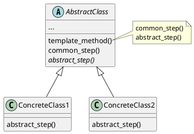

Defines commons steps of an algorithm in a superclass but allows subclasses to override specific steps of the algorithm without changing its structure.

1. Extract out common steps into a abstract base class as implemented methods.
2. Extract out different steps into abstract base class as abstract methods.
3. Move all calls to these method into a **template method**.

# Usage

* Several functionalities with identical algorithms and some minor differences.
* Limit extensions to the class to only the abstract methods.