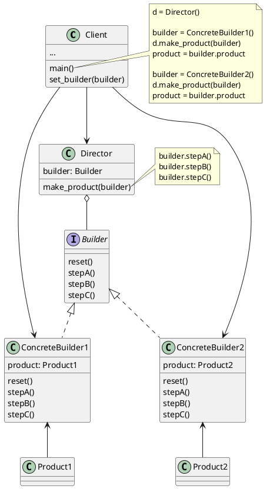

#  Builder

Construct complex objects step by step allowing different object types with the same construction code.

* The different object types does not need to implement the same interface.

## Usage
* Reduce structure with many subclasses
* Reduce constructor with many optional parameters
* Let client build their own object step by step without returning the object until the client calls for the return.