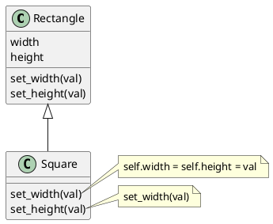

# Single-Responsibility Principle

> There should never be more than one reason for a class to change.

* Reduces complexity of a single class
* Reduces refactoring

## Pragmatics

* Break down classes once they're too big to handle
* A thing doing an action can have its action being done to the thing.

  ```puml
  @startuml
  class Employee {
    + name
    + print_department()
    + print_tax_info()
  }
  @enduml
  ```

  ```puml
  @startuml
  class Employee {
    + name
    + print_department()
  }
  class TaxReport {
    ...
    print(employee: Employee)
  }

  Employee <- TaxReport
  @enduml
  ```

# Open/Close Principle

> Classes should be open for extension but closed for modification.

* Reduces risk of breaking a well-tested class when adding new features

## Pragmatics

* Add a new feature to a class by subclassing the common feature

  ```puml
  @startuml
  class Food {
  foods: array[tuple[string, float]]
  get_calories()
  }
  note left of Food::get_calories
    for food_name, weight in foods:
      if (food_name == "apple") {return weight * 30}
      else if (food_name == "burger") {return weight * 300 }
      else ...
  end note
  @enduml
  ```

  Adding more types to the above would require modifying the `Workout` class. Imagine even more methods that requires a check to `Workout::type`, we would also need to modify those.

  ```puml
  @startuml
  Meal o-right-- Food
  Food <|-- Apple
  Food <|-- Burger

  class Meal {
  foods: array[Food]
  get_calories()
  }
  note left of Meal::get_calories
    return sum(food.calories() for food in self.foods)
  end note

  abstract Food {
    {static} calories_per_weight
    weight
    get_calories()
  }

  class Apple {
  }

  class Burger {
  }

  @enduml
  ```

# Liskov Substitution Principle

> Functions that use pointers or references to base classes must be able to use objects of derived classes without knowing it

Basically, any subclass must be compatible with all methods that takes in its superclass. Specifically this principle has the following rules:

1. Overridden method types should match or more abstract
2. Overridden return types should match or be a subtype
3. Overridden methods exceptions should not throw newer ones
4. Overridden methods pre-conditions shouldn't be stronger
5. Overridden methods post-conditions shouldn't be weaker
6. Invariants must be preserved.
7. Don't override private fields

Take this motivating example where we the following class design:



Say we have a function `change_aspect_ratio(rectangle, width, height)` that changes the aspect ratio by keep the area of a `Rectangle`. The issue is this method is not compatible with a Square. This examples violates (6) that mutating the width and height does not affect each other.

# Interface Segregation Principle

> Many client-specific interfaces are better than one general-purpose interface

A general-purpose interface can have a lot more methods to be implemented than the concrete class needs causing a lot of unimplemented functions.

## Pragmatics

* Break down interfaces into many interfaces
  * Break down routes and endpoints
* This is a double edge sword since more interfaces means more complexity

# Dependency Inverstion Principle

> Depend upon abstractions, [not] concretions

## Pragmatics

* Design and/or implement high-level classes first before low-level classes.
* Aligns with the direction of test-driven development.
