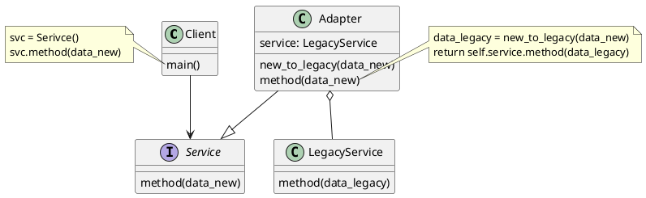

Allows objects of incompatible interfaces to interact. Also known as **wrapper**.

```puml
@startuml
  Client --> Service
  Adapter o-- LegacyService
  Adapter --|> Service

  class Client {
    main()
  }
  note left of Client::main
    svc = Serivce()
    svc.method(data_new)
  end note

  interface Service {
    method(data_new)
  }


  class LegacyService {
    method(data_legacy)
  }

  class Adapter {
    service: LegacyService
    new_to_legacy(data_new)
    method(data_new)
  }
  note right of Adapter::method
    data_legacy = new_to_legacy(data_new)
    return self.service.method(data_legacy)
  end note
@enduml
```