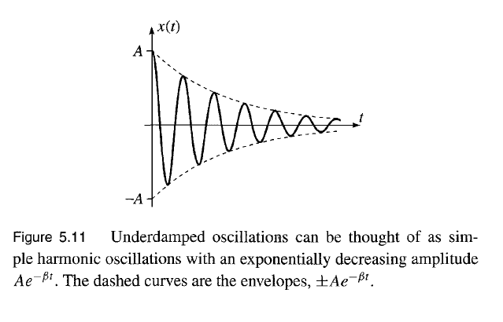
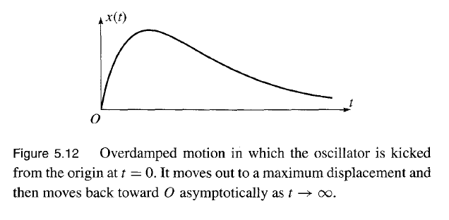

#  Oscillators

## Hooke's Law
The equation for the force that governs simple harmonic motion comes from Hooke's law. In 1D that equation is famously written as,

$$
\begin{align}
    F(x) &= -kx\\
    U(x) &= \frac{1}{2}kx^2
\end{align}
$$

## Simple Harmonic Oscillator
By Newton's second law, the equation of motion for the simple harmonic oscillator (follows Hooke's law directly) is,

$$
\begin{align}
    m\ddot{x} &= -kx \nonumber\\
    \ddot{x} &= -\frac{k}{m} x
\end{align}
$$

Most are more used to using the natural frequency constant $\omega \equiv \sqrt{\frac{k}{m}}$

$$
\begin{align}
    \ddot{x} &= -\omega x
\end{align}
$$

This second order differential equation has the solutions,

$$\begin{gather}
    \boxed{x(t) = C_1e^{i\omega t} + C_2e^{-i\omega t}}\\
    C_1 = C_2^*\\
    \nonumber\\
    \boxed{x(t) = B_1\cos(\omega t) + B_2\sin({\omega t})}\\
    B_1 = C_1 + C_2 = x(0), \qquad B_2 = i(C_1 - C_2) = \frac{\dot x(0)}{\omega}\\
    \nonumber\\
    \boxed{x(t) = A\cos(\omega t - \delta)}\\
    A = \sqrt{B_1^2 + B_2^2}, \qquad \delta = \tan\left(\frac{B_2}{B_1}\right)\\
    \nonumber\\
    \boxed{x(t) = \text{Re }Ce^{i\omega t}}\\
    C = 2C_1\\
    \nonumber\\
    \boxed{x(t) = \text{Re}Ae^{i\omega t - \delta}}
\end{gather}$$

## Multivariable Oscillators
Multivariable oscillators are simple only and a simple harmonic motion can be achieved if we consider Hooke's law to be applied separately for each dimension. Say for $N$-dimensions, there are $N$ differential equations each with possibly different amplitude $A_i$ and different frequencies $\omega_i$ (where $i$ goes from $x_1$ to $x_2$) then we may generalized the solution for each dimension to be,

$$ \begin{equation}
    \boxed{\boldsymbol{r} = \sum_{i=1}^N{A_i\cos(\omega_i t - \delta_i) \hat{x}_i}}
\end{equation} $$

We may define a relative phase shift $\delta_{ij} = \delta_j - \delta_i$ for $j \ne i$. This is ususually useful in only one dimension since there exist only one $\delta_{ij}$ for instance let $\delta \equiv \delta_{yx}$:

$$
\begin{gather}
    x = A_x\cos(\omega_x t)\\
    y = A_y\cos(\omega_y t - \delta)
\end{gather}
$$

## Damped Oscillators
We consider an oscillator damped by a resistance force $F_{f} = -b\dot x$ such that the differential equation becomes,

$$ \begin{align}
    m\ddot x + b\dot x + kx = 0\\
    \boxed{\ddot x + 2\beta\dot x + \omega^2 x = 0}
\end{align} $$

* $\beta$ : **Damping constant** where $\beta \equiv b/2m$\\
* $\omega$ : As usual, the natural frequency $\omega^2 = k/m$

The solution to this equation is an exponential solved by the **auxiliary equation** method where,

$$ \begin{gather}
    r_1 \equiv -\beta + \sqrt{\beta^2 - \omega^2}\\
    r_2 \equiv -\beta - \sqrt{\beta^2 - \omega^2}\\
    \boxed{x(t) = C_1e^{r_1 t} + C_2e^{r_2 t}}
\end{gather} $$

To visualize this solution we look at three cases seeing how $\beta$ compares with $\omega$.

Undamped Oscillation
: For $\beta = 0$ we expect to get the original harmonic oscillator

$$ \begin{gather}
    \boxed{x(t) = C_1e^{i \omega t} + C_2e^{-i \omega t}}
\end{gather} $$

Underdamping Oscillation
: For $\beta < \omega$, the solution is a enveloped wave,

</img>

$$ \begin{gather}
    \omega_1 \equiv \sqrt{\omega_0^2 - \beta^2}\\
    x(t) = e^{-\beta t}\left(C_1e^{i\omega_1 t} + C_2^{-i\omega_1 t} \right)\\
    \boxed{x(t) = Ae^{-\beta t}\cos(\omega_1 t - \delta)}
\end{gather} $$

Overdamping Oscillation
: For $\beta > \omega$, we observer a quickly dying non-periodical wave.

</img>

Critical Damping Oscillation
: For $\beta = \omega$, the solution is an exponential decay,

$$ \begin{equation}
    \boxed{x(t) = C_1e^{-\beta t} + C_2 t^{e^{-\beta t}}}
\end{equation} $$

## Damped Driven Oscillator
A driven oscillator adds in an external force call the driven force $F_d(t)$. The damped driven oscillator is simply,

$$ \begin{gather}
    F(t) = F_d(t) - b\dot x - kx\\
    \boxed{\ddot x + 2\beta \dot x + \omega_0^2 = f(t)}
\end{gather} $$

* $f(t)$ : The acceleration contributed by the external agent where $ f(t) = F_d(t)/m$